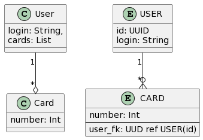
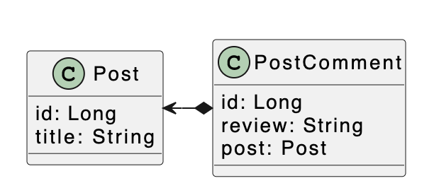

# **Зачем нужен JPA (Hibernate)**

Разрабатывая архитектуру приложения на основе ООП парадигмы мы оперируем объектами и методами. И для обеспечения возможности расширения и долгосрочной поддержки такого приложения доменную модель стоит разрабатывать пользуясь подходом application first. То есть сначала мы строим модель на основе классов, затем переносим ее в табличное представление, а не наоборот. Но объектное и табличное представление имеют много существенных отличий.

> ****JPA -**** это только спецификация. Она была разработана на основе API Hibernate. Для работы требуется JPA Provider - Hibernate, например. Помимо Hibernate есть и другие провайдеры - Eclips Link, OpenJPA.

## **Различия в представлениях**

Если для простой доменной модели различия между объектным и табличным представлением не сильно повлияет на реализацию логики, то для более сложных моделей мы явно столкнемся со следующими проблемами:

### Наследование таблиц
Наследование таблиц в стандарте SQL не поддерживается. Есть, например, [поддержка из коробки от postgreSQL](https://www.postgresql.org/docs/current/ddl-inherit.html),  но зависимость от вендора накладывает некоторые ограничения

### Идентичность
Идентичность объектов можно спокойно реализовывать на основе бизнес полей. Например класс `User(login, password, name, age)` \- идентичность можно обеспечить только по полю `login`.

Идентичность в реляционной модели обеспечивается по первичному ключу. Но если в качестве первичного ключа в таблице `USER` выбрать `login`, то при его изменении нужно будет учитывать все внешние ключи, которые на него ссылаются.

Поэтому в таблицах для обеспечения идентичности используются **суррогатные ключи** (автоматически сгенерированные идентификаторы). Такие искусственные ключи плохо ложатся на объектную доменную модель.

### Ассоциации
Ассоциации между объектами обеспечиваются ссылками из одного объекта на другой. Ассоциации между таблицами поддерживаются внешними ключами, дублируя значения ключа.
Это влияет на направленность связи. Например:

Видно, что главной сущностью этой связи является объект `User`.
В объектной ассоциации именно `User` хранит список объектов `Card`.

В табличном представлении нельзя в одной строке таблицы хранить список ссылок на строки другой таблицы.
Столбец внешнего ключа расположен в таблице `CARD` и тут уже таблица `CARD` ссылается на таблицу `USER`, а не наоборот.
*Объектные и табличные фактически связи имеют разное направление.*

Помимо этого объектные ассоциации поддерживают связь many-to-many, в то время как в реляционных БД эта связь не поддерживается естественным образом - нужна таблица посредник.

### Доступ к данным
Существует фундаментальное различие между доступом к данным в Java и в БД.
Допустим, вам нужно сгруппировать список карт по пользователям. В Java вы вызываете такой код

```java
Map<String, List<Card>> cardByUser = new HashMap<>();
//given list of cards
cards.forEach(card -> {
    // it's OK for java
  // But there is a problem here from SQL perspective
    User user = card.getUser();
    cardByUser.computeIfAbsent(
        user.getLogin(),
        new ArrayList<>()
    ).add(card);
})
```

Это наиболее удобный способ обхода графа объектов в Java. Однако такой способ является неэффективным в SQL. Он может привести к проблеме N + 1 запроса:

```sql
/* 1 query for cards */
select * from CARD

/*
then for each card you execute N queries:
*/
select * from USER where USER.id = CARD.user_fk
```

Для повышения производительности нужно уменьшить количество запросов к БД. Это достигается обычно с помощью соединения таблиц.

Различие способов доступа к данным чаще всего приводят к проблемам с производительностью.

## Главная цель ORM
(И цель Hibernate в частности) - автоматически преобразовывать объектное представление в табличное, решая вышеуказанные проблемы и автоматически генерировать SQL запросы в ответ на изменение состояния объектов.

**Также Hibernate из коробки предоставляет следующие возможности:**

- JDBC batching без изменения кода доступа к данным
- Поддержка оптимистических блокировок (в JDBC не предоставляет такого API)
- Независимая от вендора БД абстракция для пессимистичных блокировок
- Независимая от вендора БД поддержка постраничных запросов
- Возможность использовать java.util.List в условиях поиска с IN
- кэш (первого, второго уровня) и кэш запросов
- Возможность использовать нативные запросы

**При этом у Hibernate есть и свои минусы:**

- Hibernate предоставляет удобные абстракции и API, но не избавляет от необходимости изучать JDBC API, базы данных и SQL. Порог входа в hibernate очень низок, но чтобы стать экспертом - нужно понимать, как устроена работа уровенем ниже.
- Есть много неочивидных моментов, которые могут обескуражить в начале знакомства с Hibernate-ом, если о них не знать. Например [порядок вызова методов EntityManager#flush()](https://vladmihalcea.com/hibernate-facts-knowing-flush-operations-order-matters/) или [FetchType.EAGER по умолчнию](https://vladmihalcea.com/hibernate-facts-the-importance-of-fetch-strategy/#:~:text=So%20what%20is%20the%20entity%20fetching%20strategy%20anyway%3F) при запросе сущностей.
- The Criteria API

# Entity Manager

## Жизненный цикл сущностей

JPA оперирует сущностями - классами, помеченными аннотацией `@Entity`.
```java
import org.hibernate.annotations.NaturalId;

import javax.persistence.*;

@Entity(name = "Post")
@Table(
        name = "post",
        uniqueConstraints = @UniqueConstraint(
                name = "slug_uq",
                columnNames = "slug"
        )
)
@Data
@Builder(toBuilder = true)
@NoArgsConstructor
@AllArgsConstructor
public class Post {

    @Id
    @GeneratedValue(strategy = GenerationType.SEQUENCE)
    private Long id;

    private String title;

    @NaturalId
    private String slug;
}

```

У каждой сущности должен быть идентификатор - поле, помеченное аннотацией `@Id`. Значение идентификатора можно генерировать как в приложении, так и предоставить возможность Hibernate-у сгенерировать его автоматически. Автоматическая генерация идентификаторов это тема для отдельного разговора.

> Для простого случая можно пометить идентификатор аннотацией
`@GeneratedValue(strategy = GenerationType.SEQUENCE)`.
При этом в БД будет создана последовательность с названием `hibernate_sequence`, и идентификаторы будут генерироваться при каждом вызове `persist`. Об этом вызове ниже.

Для управления сущностями JPA использует объект `EntityManager` - он служит центральной точкой входа в функциональность, предоставляемую JPA, и позволяет создавать, обновлять, удалять и запрашивать данные из БД.

`EntityManager` не является потокобезопасным. Более того - рекомендуется создавать новый `EntityManager` для каждой новой транзакции.

> Так делается в spring, например.
Когда мы инжектим `EntityManager`, [мы получаем прокси](https://docs.spring.io/spring-framework/docs/current/javadoc-api/org/springframework/orm/jpa/SharedEntityManagerCreator.html)

> При старте новой  логической транзакции эта прокся делигирует в уже существующий для данной транзакции `EntityManager`, либо, если подходящий EM еще не существует - создает новый.

`EntityManager` создается с помощью метода `EntityManagerFactory#createEntityManager()`

Каждая сущность имеет свой жизненный цикл. Важно понимать, что жизненный цикл сущности имеет смысл только в отношении конкретного экземпляра `EntityManager`-а. Сама сущность ничего не знает о своем состоянии. И одна и та же сущность может находиться разных состояниях для разных экземпляров `EntityManager`-а

Во многих источниках определяются следующие четыре состояния для сущности:


На диаграмме видно, что сущность меняет свое состояние при вызове методов `persist`, `merge`, `remove`  и др.  у  `EntityManager`-а

### Методы Entity Manager-а

#### persist, find, JPQL и native queries
Метод  `persist(Object)` переводит сущность из состояния `NEW` в `MANAGED`. Для сущностей в состоянии `MANAGED` ***EM начинает отслеживать все изменения.***

Метод `find(Object, Id)` находит запись в БД по идентификатору, создает сущность на основе этой записи и переводит ее в состояние `MANAGED`.

Помимо метода `find` запрашивать данные из БД можно с помощью запросов в синтаксисе JQPL и нативных запросов:
```java
Query singleResQ = em.createQuery("select p from Post p where p.id = 1", Post.class);
Post p1 = singleResQ.getSingleResult();

Query multResQ = em.createQuery("select p From Post", Post.class);
List<Post> posts = multResQ.getResultList()

Query nativeSingleResQ = em.createNativeQuery("select * from post where id = 1", Post.class);
Post p2 = nativeQuery.getSingleResult();

Query nativeMultResQ = em.createNativeQuest("select * from post");
List<Post> nativeQPosts = nativeMultResQ.getResultList();

```

Возвращенные в результате этих запросов сущности также переходят в состояние `MANAGED` и отслеживаются `EntityManager`-ом.

*** **В spring data jpa** тоже можно запрашивать данные из БД с помщью JPQL или нативных запросов используя репозитории:
```java

public interface PostRepository extends JpaRepository<Post, Long> {

    @Query(
            nativeQuery = true,
            value = "select * from post where  id = :id"
    )
    Post selectNativeById(@Param("id") Long id);

    @Query(
            nativeQuery = true,
            value = "select * from post"
    )
    List<Post> selectNativeAll();

    @Query("select p from Post p where p.id = :id")
    Post selectById(@Param("id") Long id);

    @Query("select p from Post p")
    List<Post> selectAll();
}

```

И все эти запросы также будут возвращать сущности, которые в рамках транзакции будут находится в состоянии `MANAGED` для определенного в этой транзакции `EntityManager`-a.

#### detach
После закрытия `EntityManager`-а или после вызова метода `detach` сущность переходит из состояния `MANAGED` в состояние `DETACHED`. В этом состоянии сущность отвязана от  `EntityManager`-а. Это означает, что какие бы изменения вы не делали с `DETACHED` сущностью, после коммита транзакции эти изменения не попадут в базу.

#### remove
Метод `remove` удаляет сущность, перенося ее в состояние `REMOVED`. Как и в состоянии `DETACHED`, в `REMOVED`  сущность также отвязана от `EntityManager`-а. Разница только в том, что метод `remove` указывает `EntityManager`-у отправить запрос  `DELETE` в базу после коммита транзакции.

#### merge
Метод `merge` служит в основном для обновления данных.
Допустим в транзакции TX1 вы достали сущность из БД.
После коммита TX1 и закрытия EM эта сущность перейдет в состояние `DETACHED`.

```java
EntityManagerFactory emf = getEMF();
var em = emf.createEntityManager();
var tx = em.getTransaction()
	
tx.begin();
Post post = em.find(Post.class, 1L);
tx.commit();

em.close();
// after closing EM the post entity goes into DETACHED state
```

Далее вы открываете TX2, изменяете сущность и хотите сохранить изменения, то есть выполнить `UPDATE` в базе. Для этого вы вызываете метод `merge` с измененной сущностью.

```java
post.setTitle('updated post');

em = emf.createEntityManager();
var tx = em.getTransaction();

tx.begin();
var mergedPost = em.merge(post);
em.contains(post) == false;
em.contains(mergedPost) == true;
// UPDATE is not sent to database till commit the transaction

tx.commit();
```

Однако старая сущность останется в состоянии `DETACHED` навсегда. Метод `merge` создает новую сущность и возвращает ее. И она уже будет в состоянии `MANAGED`.
> Следует упомнять, что код изменения `DETACHED` сущности не обязательно должно быть после открытия транзакции. `DETACHED` сущность - это обычная DTO, и вы можете делать с ней все, что угодно. Экземпляр `DETACHED` сущности уже никогда не перейдет в состояние `MANAGED`.


## Entity Manager flushing

JPA автоматически отправляет изменения в БД после коммита транзакции.
Явно вызывать `EntityManager#flush()` не нужно - это считается плохой практикой.

Помимо коммита транзакции `EntityManager#flush()` может быть спровоцирован рядом других событий:
- JPQL запросы
- Запросы через Criteria API
- Нативные запросы

Это нужно для поддержания консистентности данных с **кэшом первого уровня**. Подробнее об этом [чуть далее](#read-your-own-writes-consistency)

Видимость этих изменений в других транзакциях зависит от их уровня изоляции.
По умолчанию в JPA используется уровень READ COMMITED. Поэтому сюрпризов быть не должно и эти изменения не должны быть видны другим транзакциям (конечно, если вы об этом явно не попросите).

### Кэш первого уровня
После того, как сущность была переведена в состояние `MANAGED`, она сохраняется внутри `EntityManager`-а в мапе:

```java
Map<EntityUniqueKey, Object> entitiesByUniqueKey = new HashMap<>(INIT_COLL_SIZE);
```

А ключ для мапы определяется следующим образом:

```java
public class EntityUniqueKey implements Serializable {
 
    private final String entityName;
     
    private final String uniqueKeyName;
     
    private final Object key;
     
    private final Type keyType;
     
    ...
 
    @Override
    public boolean equals(Object other) {
        EntityUniqueKey that = (EntityUniqueKey) other;
         
        return that != null &&
            that.entityName.equals(entityName) &&
            that.uniqueKeyName.equals(uniqueKeyName) &&
            keyType.isEqual(that.key, key);
    }
     
    ...
}
```

И эта мапа используется в качетве кэша первого уровня, который работает по стратегии [write-behind.](https://vladmihalcea.com/a-beginners-guide-to-cache-synchronization-strategies/#:~:text=current%20transaction%20changes-,Write%2Dbehind%20caching,-To%20speed%20up)


Алгоритм поиска сущности в `EntityManager` выглядит следующим образом:


1) Сначала происходит поиск в мапе EntityManager-а
2) Затем в кэше второго уровня (если настроен)
3) В последнюю очередь EM делает запрос в БД


```java
// select * from USER where id = 1 && save it to cache
User selectedUser = em.find(User.class, 1L);

// cache hit
User cachedUser = em.find(User.class, 1L);

// two objects are identical i.e.
// the object's references point to same memory address
assert selectedUser == cachedUser
```


**Такой кэш дает ряд преимуществ**

**Батчинг**
Все изменения сущности аккумулируются в батч и исполняются один раз при выполнении `EntityManager#flush()`

**Повторяемое чтение**

Как известно спецификация ANSI определяет 4 уровня изоляции транзакций:
- READ UNCOMMITED
- READ COMMITED
- REPEATABLE READ
- SERIALIZABLE

Уровни изоляции определяют тот уровень несинхронизированного конкуретного доступа к данным, который допускается в конкретном приложении.

По умолчанию во многих в БД используется уровень READ COMMITED, как наиболее компромиссный в том смысле, что он позволяет избежать самые неудобные аномалии:  DIRTY READ и DIRTY WRITE
При этом допускаются следующие:
- NON REPEATABLE READ
- LOST UPDATE
- PHANTOM READ

Уровень REPEATABLE READ фактически (в PostgreSQL и MySQL) позволяет избежать даже таку аномалию как PHANTOM READ. А в PosgreSQL даже LOST UPDATE.

Однако, например, в Oracle уровень REPEATABLE READ не поддерживается. Oracle Driver выкинет исключение, если попытаться начать транзакцию с этим уровнем.

*Но зато SERIALIZABLE в Oracle делает примерно то же, что и REPEATABLE READ в PostgreSQL и MySQL, а настоящего SERIALIZABLE в Oracle нет.*

Так вот, даже с уровнем изоляции READ COMMITED кэш первого уровня позволяет имитировать уровень REPEATABLE READ, но все же допуская аномалии PHANTOM READ и LOST UPDATE.

### Read-your-own-writes consistency
Так как любой запрос - JPQL, Criteria API, Native Query - всегда достигает базы данных (кроме случаев, когда происходит second level cache hit), то нужно быть уверенным, что все зафиксированные в EM изменения попадут в базу перед выполнением запроса. Как минимум потому, что логика запроса может быть основана на этих изменениях.

Для этого в спецификации JPA определена так называемая **flush-before-query** стратегия синхронизации. То есть, как уже поминалось ранее, по умолчанию JPQL, Criteria API и нативные запросы провоцируют `EntityManager#flush()`.

*** **В spring data jpa** такое поведение также определено по умолчанию.

### Кэш первого уровня для запросов

Если не настроен кэш второго уровня, любые запросы всегда будут уходить в базу.
При этом, так как в JPA уровень изоляции транзакций по умолчанию настроен READ COMMITED,  то запросы могут провоцировать следующие аномалии:
- NON REPEATABLE READ
- LOST UPDATE
- PHANTOM READ

При обработке результата запроса JPA сравнивает результаты с сущностями, которые уже есть в кэше. И если находит сущности с двумя одинаковыми идентификаторами - выбирает ту, которая есть в кэше, а не ту, которая пришла в результате запроса.
Таким образом мы избавляемся от аномалии: NON REPEATABLE READ

В случае, если данные были удалены, запрос не найдет их БД. Так как в результате запрос не вернет ни одной сущности, то никакой попытки пойти в кэш и не будет.

В случае, если данные наоборот были добавлены, запрос найдет эти данные, хотя в кэше их нет.

Таким образом защиты от фантомного чтения не происходит.

Защита от LOST UPDATE может быть реализована [с помощью оптимистических блокировок.](https://vladmihalcea.com/optimistic-locking-version-property-jpa-hibernate/)

Все вышесказанное справедливо как для JPA: JPQL и нативных запросов, так и для spring data jpa используя репозитории.
***
**( ! )** Однако по поводу нативных запросов следует сказать, что не все нативные запросы будут сравнивать полученные из БД данные с сущностями в кэше. Сравнение будет происходить, когда в результате запроса возвращается именно сущность, и в списке вывода (selection list) присутствуют колонки, соответствующие всем полям данной сущности.

Например следующий запрос вернет данные из базы, несмотря на то, что сущность с переданным идентификатором будет в кэше:
```java
@Query(
		nativeQuery = true,
		value = "select title from post where id = :id"
)
String selectTitleById(@Param("id") Long id);
```
***
### Разогрев кэша первого уровня

Сущность попадает в кэш EM при:
- вызовах `persist` или `merge`
- если была найдена методом `find`
- Если была найдена в результате запросов JQPL, Criteria API и Native Query

В случае с Native Query есть один нюанс: сущность попадает в кэш только в том случае, если при создании запроса был указан тип (класс) сущности.
```java
	em.createNativeQuery(
			"select * from post",
			Post // entity type is specified
	).getResultList()
	// cache will be populated with found entities
```

Если тип не указывать, то даже если сущность была найдена в результате запроса, в кэш она не попадет - недостаточно информации для создания ключа мапы.
```java
// entity type is not specified
 em.createNativeQuery("select * from post")
		.getResultList()
// cache woun't be populated with found entities
```

*** **spring data jpa**
Разогрев кэша также происходит при выполнении запросов используя **`JpaRepository`**.

Это касается:
-  существующих методов (`findById`, `findAll`, ...)
-  сгенерированных запросов на основе парсинга названия метода
-  JPQL запросов через аннотацию `@Query`
-  Нативных запросов через аннотацию `@Query`
***
**( ! )** Наверное стоит упомянуть, что сущности будут попадать в кэш, только если нативный запрос возвращает именно сущность (или список сущностей), а не проекции, то есть в *списке вывода* запроса присутствуют все колонки, которые соответствуют полям возвращаемой сущности.

Например при выполнении следующего запроса сущность переданным id не будет помещена в кэш

```java
@Query(
		nativeQuery = true,
		value = "select title from post where id = :id"
)
String selectTitleById(@Param("id") Long id);

```

# Object/relation mappings

Существует три типа маппингов в JPA:
- Сущности (`@Entity`)
- Простые типы (String, Long, Dobule, Date, Boolean и т.д.)
- Встраиваемые типы (`@Embeddable`)

## Встраиваемые типы

Отличаются от сущностей тем, что им запрещено иметь собственный идентификатор.

 ```java
@Table(name = "users")
@Entity
class User {
	@Id
	@Column(name ="id")
	Long id;
	
	@Column(name = "login")
	String login;
	
	@Embedded
	FullName fullName;
}

@Embeddable
class FullName {
	
	@Column(name = "first_name")
	String firstName;
	
	@Column(name = "last_name")
	String lastName;
}
```

Они отлично подходят для реализации такого вида ассоциации из UML, как [композиция](https://en.wikipedia.org/wiki/Class_diagram#Composition)

В табличном представлении поле `fullName` "раскрывается" в две отдельные колонки таблицы `users`

```sql
create table users(
	id bigint primary key,
	login varchar(256),
	first_name varchar(256),
	last_name varchar(256)
)

```

## Связи между сущностями

Мы рассмотрим основные виды связей
- many-to-one (one-to-many)
- one-to-one
- many-to-many

***

### @ManyToOne

Связь **many-to-one** представляет собой дочернюю сторону связи one-to-many между двумя таблицами. Дочерняя сторона в данном случае - это таблица, в которой располагается **внешний ключ** связи.


В данном примере к одному посту можно оставить несколько комментариев.
И один коментарий может принадлежать только одному посту.

Соответствующую связь между объектами `Post` и `PostComment` можно представить композицией:



Чтобы отобразить такую связь, используется аннотация `@ManyToOne` в дочерней сущности:

```java
@Entity(name = "PostComment")
@Table(name = "post_comment")
public class PostComment {

    @Id
    @GeneratedValue(strategy = GenerationType.SEQUENCE)
    Long id;

    String review;

    @ManyToOne
    Post post;
}
```

При этом по умолчанию название колонки для внешнего ключа строится из:
"*название поля для родительской сущности*"_"*название поля идентификатора в родительской сущности*"

Т.е. в данном случае:
"название поля родительской сущности" = "post"
"название поля идентификатора в родительской сущности" = "id"
=> `post_id`

Чтобы сконфигурировать навание колонки внешнего ключа используется аннотация `@JoinColumn`:
```java
	@ManyToOne
	@JoinColumn(name="post_fk")
	Post post;
```

Объектая ассоциация в данном случае имеет такое же направления, что и реляционная связь. То есть объект `PostComment` ссылается на объект `Post`.

Но если направление объектной ассоциации противоложное, то есть если объект `Post` ссылается на список объектов `PostComment`, нужна другая аннотация

### @OneToMany

Эта аннотация также отображает реляционную связь many-to-one

Она нужна, чтобы поменять направленность ассоциации между объектами.
Различают два вида @OneToMany:
- **Двунаправленная**
- **Однонаправленная**:
***
#### Двунаправленная @OneToMany

Двунаправленная она потому, что в дочерней сущности есть соответствующая `@ManyToOne` ассоциация.

```java
@Entity
@Table(name = "post")
public class Post {

    @Id
    @GeneratedValue(strategy = GenerationType.SEQUENCE)
    private Long id;

    private String title;

    private String slug;

    @Builder.Default
    @Setter(AccessLevel.PRIVATE)
    @OneToMany(mappedBy = "post")
    List<PostComment> postComments = new ArrayList<>();
```

При этом владельцем связи считается дочерняя сущность. Это значит, что именно **дочерняя сущность контролирует синхронизацию значения колонки внешнего ключа с кэшом `EntityManager`-а.** Параметр `mappedBy` нужно указывать именно для того, чтобы показать, что сущность не является владельцем связи.

Если параметр `mappedBy` не указать, hibernate не поймет, что мы имеем ввиду, и создаст в БД третью таблицу:
```sql
create table post_post_comments (
	post_id bigint not null,
	post_comments_list_id bigint not null
)
```
***
Несмотря на то, что за синхронизацию внешнего ключа отвечает дочерняя сущность, поддерживать объекты в актуальном состоянии нужно и родительской и в дочерней сущности. Автоматически hibernate это не делает.

Ниже показан пример, как нужно правильно добавлять/удалять сущность `PostComments` в список:

```java
void addPostComment(PostComment postComment) {
	postComments.add(postComment);
	postComment.setPost(this);
}

void removePostComment(PostComment postComment) {
	postComments.remove(postComment);
	postComment.setPost(null);
}
```

**( ! )** Чтобы такой способ удаляния работал корректно, нужно переопределить меоды `equals` и `hashCode`. Иначе удаление из коллекции будет использовать дефолтный метод `equals`, который сравнивает ссылки.
Так тоже может сработать, но только в рамках одной транзакции. Между разными транзакциями уже могут возникать проблемы, так как одна и та же запись в БД может быть представлена разными обектами.

Одно из главных перимуществ использования двунаправленной ассоциации - это возможность каскадного распространения изменений из родительской сущности в дочернюю.
```java
@OneToMany(mappedBy = "post", cascade = CascadeType.ALL)
List<PostComment> postCommentsList = new ArrayList();
```

Например:
- если сохранить только `Post`, то все добавленные в список `postCommentsList`  комментарии тоже сохранятся.
- если удалить родительскую сущность `Post`, дочерние тоже удалятся.

При удалении комментария из коллекции списка `postCommentsList` и последующем сохранением сущности `Post`, объект `PostComment` не удалится из БД. Вместо этого в базу отправится следующий запрос:
 ```sql
 update post_comment set post_id=NULL where id=${post_comment_id}
 ```

Чтобы сущность удалилсь из БД, нужно добавить параметр
`orphanRemoval=true` в аннотацию `@OneToMany`:

```java
@OneToMany(mappedBy = "post", cascade = CascadeType.ALL, orphanRemoval = true)
List<PostComment> postComments = new ArrayList<>();
```
***
### Однонаправленная @OneToMany
В дочерней сущности **отсутствует** соответствующая @ManyToOne ассоциация. При этом ***владельцем связи считается родительская сущность***

Атрибут `mappedBy` больше не нужен.
Однако нужна аннотация `@JoinColumn(name="post_id")`

Если не указать `@JoinColumn` hibernate сгенерирует третью таблицу:


Поэтому отображение теперь выглядит так
```java
@OneToMany(cascade = CascadeType.ALL, orphanRemoval = true)
@JoinColumn(name = "post_id")
private List<PostComment> postCommentsList = new ArrayList<>();
```

Однако **однонаправленная связь** имеет ряд недостатков (или недоработок со стороны hibernate), так как теперь сущность `Post` отвечает за синхронизацию комментариев `PostCommnet`  с кэшом.

Допустим создается сущность `Post` с тремя комментариями, и затем сохраняется:
```java
@Transactional
public void createPostWithComments() {
	Post post = createPost("First post");
	post.addComment(createComment("My first review"));
	post.addComment(createComment("My second review"));
	post.addComment(createComment("My third review"));
	
	postRepository.save(post);
}
```

JPA отправит в БД следующие запросы:
```sql
insert into post (title, id)
	values ('First post', 1)
 
insert into post_comment (review, id)
	values ('My first review', 2)
 
insert into post_comment (review, id)
	values ('My second review', 3)
 
insert into post_comment (review, id)
	values ('My third review', 4)
 
update post_comment set post_id = 1 where id = 2
 
update post_comment set post_id = 1 where id =  3
 
update post_comment set post_id = 1 where id =  4

```

Зачем нужны три последних `update`-а? Все дело в том, в каком порядке EM выполняет операции `flush` ([вот статья](https://vladmihalcea.com/hibernate-facts-knowing-flush-operations-order-matters/) на эту тему).

`persist` выполняется перед тем, как обновляются элементы коллекции.
Таким образом, сначала EM выполняется три `insert` для комментариев без внешнего ключа.
Затем обновляет их проставляя зачение внешнего ключа.

Если добавленить в БД ограничение `non null` для внешнего ключа:
```java
@OneToMany(cascade = CascadeType.ALL, orphanRemoval = true)
@JoinColumn(name = "u_post_id", nullable = false)
List<PostComment> postComments;
```

то поведение еще более странное:
```sql
insert into post (title, id)
	values ('First post', 1)
 
insert into post_comment (review, id, post_id)
	values ('My first review', 2, 1)
 
insert into post_comment (review, id, post_id)
	values ('My second review', 3, 1)
 
insert into post_comment (review, id, post_id)
	values ('My third review', 4, 1)
 
update post_comment set post_id = 1 where id = 2
 
update post_comment set post_id = 1 where id =  3
 
update post_comment set post_id = 1 where id =  4
```

То есть JPA сгенерировал правильные `insert`, но `update`-ы все равно выполнил.

Чтобы привести дела в норму, можно добавить параметр `updatable=false` в аннотацию `@JoinColumn`. Тогда получим то, что ожидаем.

Я вначале подумал, что в этом случае сущность `PostComment` нельзя будет обновить. Однако следующий тест выполняется:
```groovy
	when:
	long changedCommentId = txTemplate.execute({
		def savedPost = uPostRepository.findById(1L).get()
		def postComments = savedPost.getPostComments()

		def postComment = postComments.get(0)
		postComment.setReview("updated review")

		uPostRepository.save(savedPost)
		return postComment.getId()
	})

	then:
	sql.query("select * from u_post_comment where id = ${changedCommentId}", {
		while (it.next()) {
			assert it.getString('review') == 'updated review'
		}
	})
```

***
### Рекомендации по использованию @OneToMany

Вообще из-за такого не очень понятного поведения рекомендуют не использовать однонаправленную `@OneToMany` связь.

Вместо нее можно использовать двунаправленную связь. А еще лучше `@ManyToOne`. Потому что использовать `@OneToMany` мы можем в том случае, [если количество дочерних элементов не велико](https://clck.ru/eef2E), так как невозможно лимитировать размер коллекции `@OneToMany`.

В большинстве случаев `@ManyToOne` - все, что вам нужно.
***

[Spring Data performs some optimisations for readOnly transactions when using JPA provider](https://docs.spring.io/spring-data/jpa/docs/current/reference/html/#:~:text=Furthermore%2C%20Spring%20performs%20some%20optimizations%20on%20the%20underlying%20JPA%20provider.%20For%20example%2C%20when%20used%20with%20Hibernate%2C%20the%20flush%20mode%20is%20set%20to%20NEVER%20when%20you%20configure%20a%20transaction%20as%20readOnly%2C%20which%20causes%20Hibernate%20to%20skip%20dirty%20checks%20%28a%20noticeable%20improvement%20on%20large%20object%20trees%29. "https://docs.spring.io/spring-data/jpa/docs/current/reference/html/#:~:text=Furthermore%2C%20Spring%20performs%20some%20optimizations%20on%20the%20underlying%20JPA%20provider.%20For%20example%2C%20when%20used%20with%20Hibernate%2C%20the%20flush%20mode%20is%20set%20to%20NEVER%20when%20you%20configure%20a%20transaction%20as%20readOnly%2C%20which%20causes%20Hibernate%20to%20skip%20dirty%20checks%20(a%20noticeable%20improvement%20on%20large%20object%20trees).")